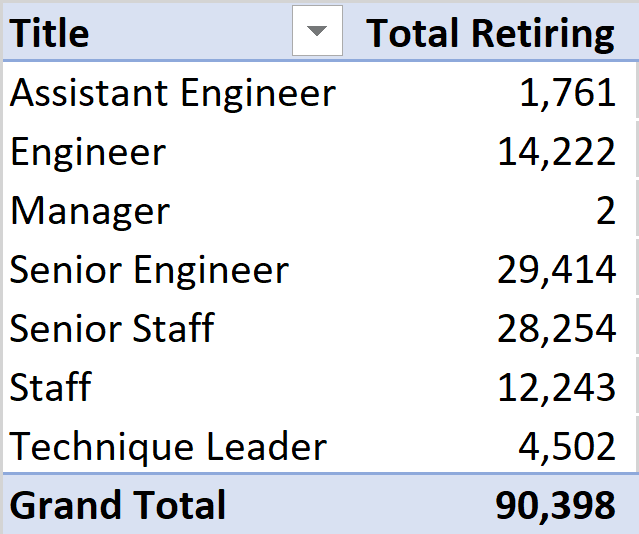
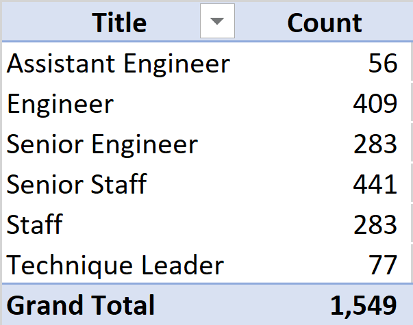
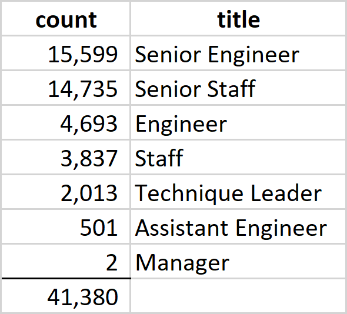
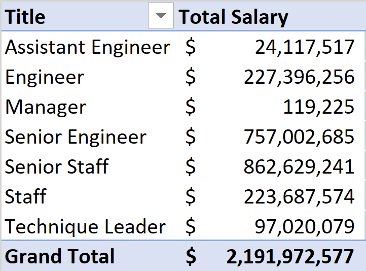
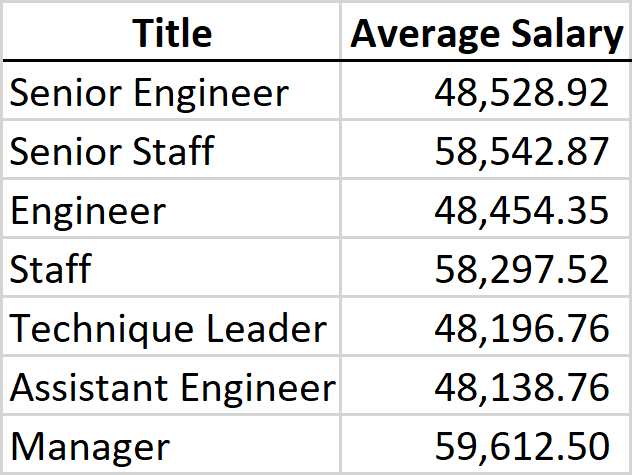

# Pewlett Hackard Analysis
## Overview
The purpose of this analysis is to determine the number of retiring employees per title and to identify employees who are eligible to participate in a mentorship program at Pewlett-Hackard. The analysis will help leadership prepare for the “silver tsunami” as many current employees reach retirement age.
## Results
 - Over 90,000 team members who were born between January 1, 1952 and December 31, 1955 are expected to retire.
 - More than half of those retiring are made up of Senior Engineers (approx. 29,000) and Senior Staff (approx. 28,000).
### Retirement Analysis Table
 
 - A small percentage of current employees born between January 1, 1965 and December 31, 1965 are eligible for mentorship. 
 - The majority of current employees available for mentorship are Engineers and Senior Staff.
### Mentorship Analysis Table

## Summary
 - Over 90,000 roles will need to be filled as the "silver tsunami" begins to make an impact, with over half being at the Senior Engineer and Senior Staff levels.  This is approximately 30% of the employee base which could potentially negatively impact Pewlett-Hackard if the recruiting team struggles to fill the necessary roles.
 - There are not enough qualified, retirement-ready employees in the departments to mentor the next generation of Pewlett-Hackard employees.  There is a very large gap between those qualified and the roles needing to be filled. For example, over 29,000 Senior Engineers are expected to retire, and only 283 are qualified to participate in the mentorship program.  All levels are experiencing this large discrepancy between those retiring and those qualified to participate in the mentorship program.
### Additional Insight 
After some additional analysis, it appears that a little less than half of future retirees are those who were hired between January 1, 1985 and December 31, 1988.  Over 41,000 of future retirees were hired between 1985 - 1988, which is still a significant number. 

Management may want to focus on this group first to see how they can be replaced with new hires or current employees through promotion.
In looking at the group of over 41,000 retiring, the related total salary by position is as follows:

Breaking it down further, the average salary per retiree by title is as follows:

This view will be helpful to management when they are looking at hiring replacement costs for budgetary purposes.  They may want to reduce replacement headcount in certain positions to save money if they are concerned about the impact to the bottom line.
